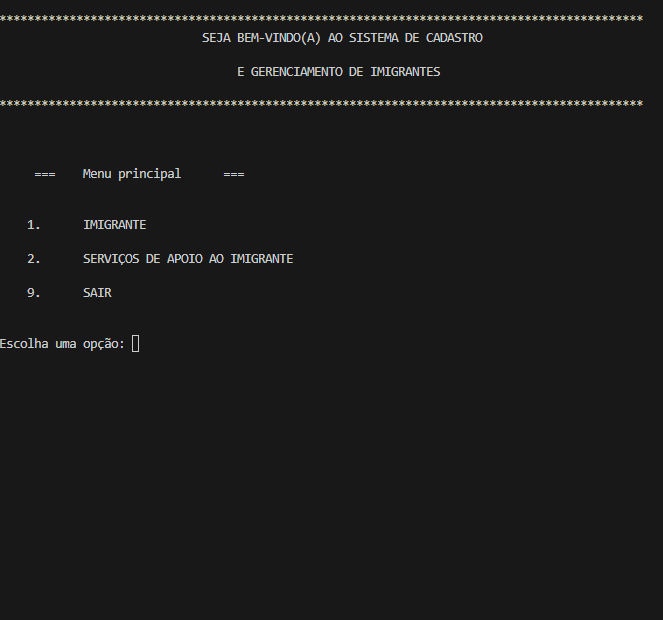

# Sistema de Cadastro e Gerenciamento de Imigrantes

Este projeto foi desenvolvido como parte do meu aprendizado inicial em programação. Ele é um **sistema de linha de comando (CLI)** escrito em Python, com objetivo de gerenciar cadastros de imigrantes e serviços de apoio.

---

## 🎯 Objetivo do Projeto

- Criar um menu interativo para cadastro e gerenciamento.
- Aplicar conceitos básicos de **funções**, **estruturas de controle**, **modularização** e **integração com banco de dados MySQL**.
- Implementar operações como **inserir, alterar, excluir e consultar** dados.

---

## 🛠️ Tecnologias Utilizadas

- **Python 3**
- **MySQL**
- Bibliotecas padrão do Python (`os`, `datetime`, `mysql.connector`)

---

## 📂 Estrutura do Projeto

sistema-imigrantes/  
│  
├── main.py # Arquivo principal com o menu geral  
├── imigranteTela.py # Menu para operações com imigrantes  
├── imigrante.py # Funções para CRUD de imigrantes  
├── apoioTela.py # Menu para serviços de apoio  
├── apoio.py # Funções para CRUD de serviços de apoio  
├── buscas.py # Funções para busca por cidade ou tipo  
├── confereID.py # Validação e conferência de IDs antes de operações  
├── opcao.py # Funções auxiliares (validação de datas, formatação)  
├── conn_example.py # Exemplo de configuração do banco  
└── README.md # Documentação do projeto

---

## 🚀 Como Executar

1. Clone este repositório:

   ```bash
   git clone https://github.com/seuusuario/sistema-imigrantes.git
   cd sistema-imigrantes

   ```

2. Execute o arquivo principal:
   ```bash
   python main.py`
   ```

🔐 **Configuração do Banco de Dados**

O projeto pode se conectar a um banco MySQL. Para isso:

1. Copie o arquivo conn_example.py para conn.py:

   ```bash
   cp conn_example.py conn.py`

   ```

2. Edite conn.py e preencha com seus dados:

`Pythonhost="SEU_HOST_AQUI"`  
`user="SEU_USUARIO_AQUI"`  
`password="SUA_SENHA_AQUI"`  
`database="SEU_BANCO_AQUI`

🖼️ **Exemplo de Execução**



✅ **Aprendizados**

Estruturação de código em módulos.
Uso de funções e controle de fluxo.
Integração básica com MySQL.
Boas práticas para proteger credenciais.

📄 **Licença**

Este projeto é livre para estudo e aprendizado.
